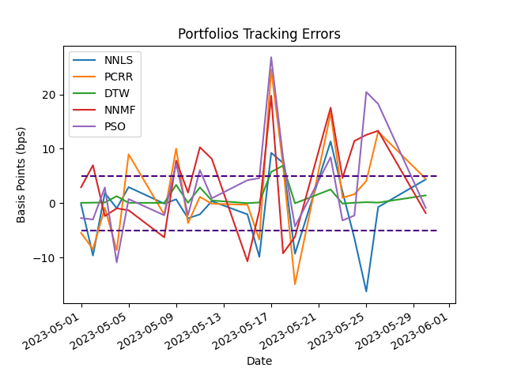

# **Dow Jones index replication with portfolio optimization methods**
The **Dow Jones Industrial Average** ("^DJI", hereinafter) is a popular stock market index that gathers 30 prominent companies listed in the U.S. stock exchanges. [Check here for general knowledge](https://en.wikipedia.org/wiki/Dow_Jones_Industrial_Average) and [here for the technical details](https://www.spglobal.com/spdji/en/documents/methodologies/methodology-dj-averages.pdf).

# The problem
Just like single stocks, stock market indexes also yield a return (positive or negative) over time. Whenever an investor wants to match exactly an index return, he/she needs to buy all the underlying stocks. This can be **considerably costly due to transaction commissions**, especially for indexes that contain hundreds of different stocks.

To overcome this problem, the investor needs to create a portfolio containing a smaller number of stocks whose aggregate return is as similar as possible to the index he/she wants to replicate. In this way, the investor can ensure a **higher overall performance simply by reducing the commission costs**.

Of course, there are limits to this kind of simplification. **The higher the number of stocks excluded from the portfolio, the higher the deviation of the portfolio return** compared to the original index (unless some of those stocks are negatively correlated with the index). This trade-off is at the core of every portfolio optimization project.

# Premise considerations
Due to some peculiarities of this project, here I list the simplifications I am taking for granted in the current version. Some of them may be considered in future versions.

*   A pool of experts changes the ^DJI stock composition periodically. For simplicity, **I will consider only the time period from the last update (August 31st 2020) to May 31st 2023**. A much more valuable approach would take a wider time range (20-30 years) and would adjust the portfolio composition dynamically along with the index updates. [For the historical components of the ^DJI check here](https://en.wikipedia.org/wiki/Historical_components_of_the_Dow_Jones_Industrial_Average).

*   The official ^DJI close is calculated by summing all the close prices of the stocks comprised in the index and dividing by a constant, the Dow Divisor. The purpose of the Dow Divisor is to ensure that extraordinary events like stock splits, spinoffs or other structural changes, do not in themselves alter the numerical value of the ^DJI. Also, the Dow Divisor is periodically updated, **I will take for granted the latest Dow Divisor (issued on November 4th 2021) for the entirety of the project period**. As for the previous assumption, a more solid approach would dynamically change the Dow Divisor when every update was published. [For the historical Dow Divisors check here](https://www.barrons.com/market-data/market-lab?mod=md_subnav).

*   Every proper portfolio optimization strategy has periodical (monthly or trimestral) checkpoint buckets to evaluate the goodness of the replica and make some rebalancing. At every checkpoint, stock weights in the portfolio can change, so that some stocks can be excluded from the next bucket and replaced by others. **I will not make periodical buckets rebalancing, and I am assuming that every of the 30 stocks of the ^DJI should get a spot in the portfolio** (with the only exception of setting the weight of a stock to zero if it brings only noise to the model). In future versions, I may prevent including a stock in the portfolio if its weight is lower than a predefined threshold, which is coherent to reduce the unnecessary commissions costs.

Lastly, I would make you notice that I am using adjusted closing prices and not just regular closing prices to try to account also splits and dividend distributions. For details see [Yahoo Finance Adj Close](https://help.yahoo.com/kb/SLN28256.html#/)

# Evaluation KPIs
I will base the replica goodness evaluation on 4 KPIs, but not all of them do have the same relevance. Here I explain their interpretation.

*   **Standard Tracking Error**. It indicates the absolute difference in actual performance between the portfolio replica and the ^DJI index. It is given by the standard deviation of the differences between the returns of the portfolio and the ^DJI. Since our goal is to replicate an index and not beat the market (god forbid), I am just interested in having low Standard Tracking Errors in absolute terms.

*   **Information Ratio**. It identifies how much the portfolio replica has exceeded the ^DJI index in terms of returns. It is given by standardizing (thanks to the tracking error) the difference in performances between the portfolio and the ^DJI. Higher information ratios indicate a desired level of portfolio strategy consistency, but without a related measure of risk, it is a really naive indicator.

*   **Portfolio Active Return**. It indicates how much the portfolio replica has performed with respect to the ^DJI index, in percentage points, at the end of the holding period. It is given by computing the difference between the total portfolio holding period return and the total ^DJI holding period return. Sometimes it can be interesting to see that, in addition to the increase in performance thanks to the reduction of commission costs, there is also a fortunate (unfortunate) factor that affects positively (negatively) the overall performance just because, in the optimization procedure, good (bad) performing stocks have been removed from the portfolio.

*   **Beta**. It is a measure of the volatility or systematic risk (not diversifiable) of a stock or portfolio compared to the reference benchmark. It is given by dividing the product of the covariance of the stock or portfolio returns and the benchmark returns by the variance of the benchmark returns over a specified period. Values higher than 1 indicate that the stock or portfolio is more volatile than the benchmark. Values between 0 and 1 indicate that the stock or portfolio is less volatile than the benchmark. Values lower than 0 indicate that the stock or the portfolio tends to move in the opposite direction with respect to the benchmark. The Beta is at the core of the modern finance theory, the [Capital Asset Pricing Model](https://en.wikipedia.org/wiki/Capital_asset_pricing_model).

